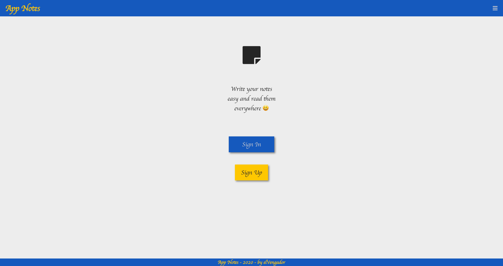

## Simple Notes - Frontend
<!-- 
 -->



**This personal project was initiated in early 2021 to showcase the skills and implementations I had at that time.** It's a simple note app organized by tags. While not actively supported, it reflects my past abilities.

Reviewing the code in 2023, I realize there are many things to improve. This is the first version. Check out Version 3, "Royal Palace," for significant upgrades.


## How to run this project
first you need to have the api of simple notes running on `http://localhost:4000`, you can get the api [here]()

To install this repository, run:
```bash
npm run install
```

then to run on localhost:
```bash
npm run dev
```

## Contribution
If you want to contribute:
- To write React components:
  - use functions
    - 1 functionality = 1 function
    - 1 function + 1 .scss => .test.js (render, functions, userEvents)
- To write scss:
  - use BEM
  - write in order:
    - box properties: display, with, height, margin, etc
    - position: position, top, left, etc
    - typography: text-transform, text-decoration, etc
    - decoration: background-image, color, etc
    - variables
    - mixins

## License

This project is licensed under the MIT License - see the [LICENSE](LICENSE) file for more details.

## Contact
If you have questions, get in touch with Jimy at **dev.jimynicanor@gmail.com**.